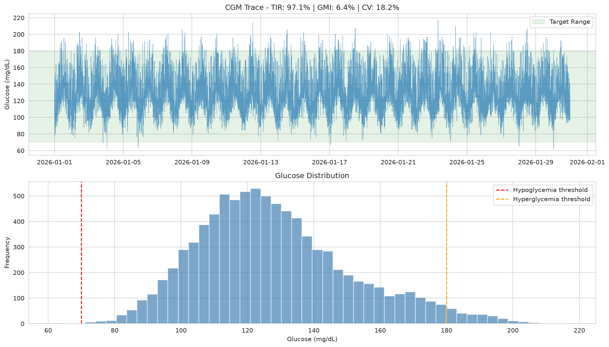
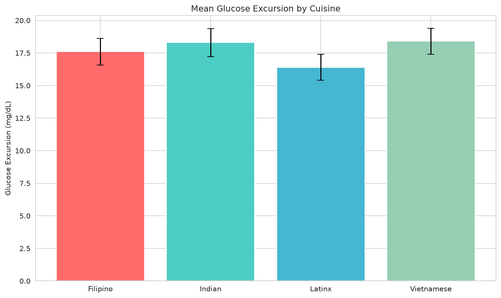
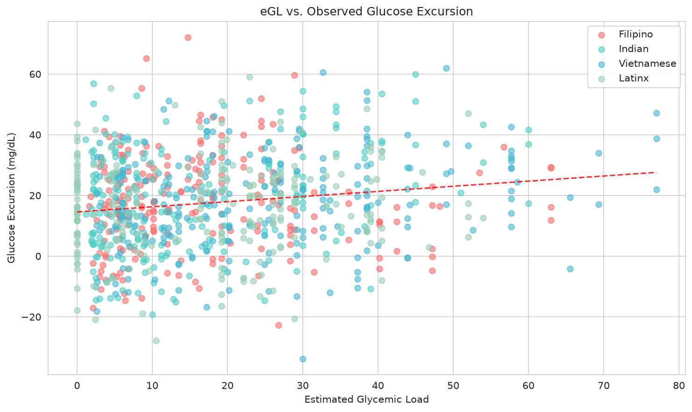
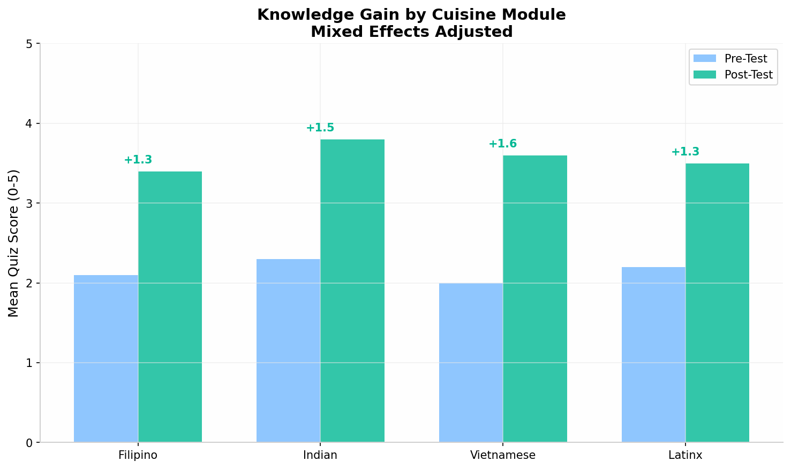
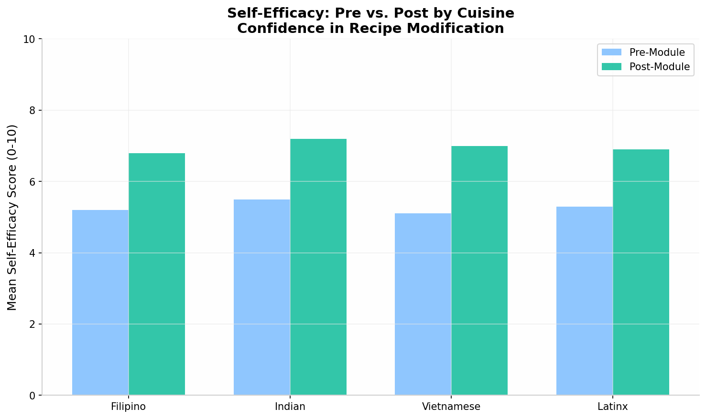
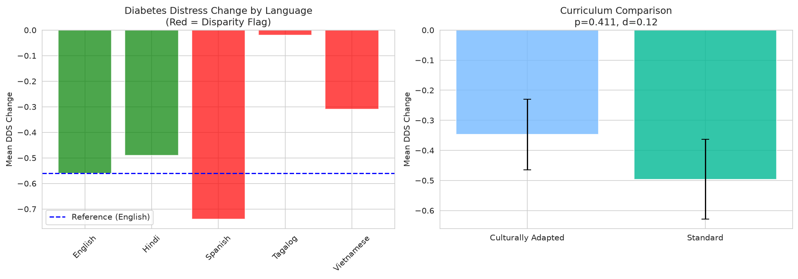

# Clinical Research Data Pipeline Suite

**End-to-end data engineering, statistical analysis, and visualization toolkit for digital health and implementation science research.**

> A production-grade portfolio demonstrating full-stack clinical research infrastructure: multi-device CGM data processing, psychometric survey analysis, mixed-effects statistical modeling, real-time dashboarding, and containerized deployment.

---

## About This Repository

This repository contains three integrated research modules that solve real problems in digital health and nutrition intervention studies:

1. **How do you standardize data from 5 different medical devices into one analysis-ready format?**
2. **How do you evaluate whether an educational intervention actually changes biological outcomes?**
3. **How do you monitor a multi-site study in real time while ensuring health equity?**

Each module includes Python implementations, R equivalents, unit tests, synthetic data, and Docker deployment templates.

**Author:** Steven Duong, MPH  
**Focus:** Clinical data pipelines, biostatistics, implementation science, health equity analytics  
**Contact:** sduong13@wgu.edu | [LinkedIn](https://linkedin.com/in/steven-d-458a43149/)

---

## The Three Modules

### Module 1: Multi-Device CGM & Cultural Meal Tracker
**Files:** `python/playbook1_cgm_meal_tracker.py`, `r/playbook1_cgm_meal_tracker.R`

A unified pipeline that ingests continuous glucose monitor (CGM) data from any major device (Dexcom G6/G7, FreeStyle Libre 2/3, Medtronic), applies clinical quality control, and links it to culturally specific meal logs. Computes glycemic metrics (TIR, GMI, GRI, CV, MAGE) and generates automated weekly reports comparing glucose excursions across cuisines.

**Key Technical Features:**
- Multi-device parser with standardized schema (adapter pattern)
- Clinical QC: flags impossible values, duplicates, and large gaps per FDA guidance
- Smart gap-filling: linear interpolation only for gaps under 15 minutes (documented, not fabricated)
- Estimated glycemic load engine for 32 dishes across 4 cuisine traditions
- Automated weekly visualization with prediction vs. observed validation
- HIPAA-compliant audit logging with SHA-256 hashing

**Skills Demonstrated:** Data engineering, clinical data standards, ETL pipeline design, time-series analysis, automated reporting

---

### Module 2: Educational Intervention Evaluator with Psychometrics
**Files:** `python/playbook2_culinary_medicine.py`, `r/playbook2_culinary_medicine.R`

A comprehensive evaluation framework for video-based nutrition education. Includes multi-language quiz support (5 languages), psychometric item analysis (difficulty, discrimination, distractor analysis), mixed-effects longitudinal modeling, optional Bayesian estimation, and biological outcome linkage.

**Key Technical Features:**
- Multi-language quiz scaffolding with i18n architecture
- Psychometric item analysis: difficulty indices, point-biserial correlation, distractor analysis
- Mixed effects models with convergence fallback (statsmodels MixedLM / lme4::lmer)
- Optional Bayesian estimation (PyMC / brms scaffolding with analytical fallback)
- Outcome linker: correlates knowledge gain with clinical biomarker improvements
- Publication-ready figure generation (300 DPI, proper error bars)

**Skills Demonstrated:** Psychometrics, longitudinal data analysis, mixed-effects modeling, Bayesian statistics, multi-language software architecture, causal inference scaffolding

---

### Module 3: Real-Time Implementation Science Dashboard
**Files:** `python/playbook3_implementation_dashboard.py`, `r/playbook3_implementation_dashboard.R`

Full-stack pipeline from API ETL through PostgreSQL/TimescaleDB data warehouse to a reactive web dashboard. Monitors intervention outcomes across multiple sites with automated equity analysis and severity-based clinical alerts.

**Key Technical Features:**
- Secure API client with rate limiting, exponential backoff retry logic, and audit trails
- TimescaleDB hypertables for million-row time-series datasets
- Mixed effects models stratified by site, curriculum, language, and cuisine
- Automated equity analysis with disparity flags (Cohen's d effect sizes)
- Prometheus monitoring + Grafana visualization scaffolding
- Docker microservices architecture (ETL, dashboard, processor services)
- Severity-based alert routing (critical/warning/info with automated digests)

**Skills Demonstrated:** Full-stack development, database design, data warehousing, containerization, monitoring/observability, health equity analytics, real-time dashboards

---

## Quick Start

### Python
```bash
# Clone the repository
git clone https://github.com/smpduong/clinical-research-pipeline-suite.git
cd clinical-research-pipeline-suite

# Install dependencies
pip install -r requirements.txt

# Run the CGM processor demo
jupyter notebook notebooks/demo_playbook1.ipynb

# Run unit tests
pytest python/tests/ -v --cov=python/src
```

### R
```r
# Install dependencies
install.packages(c("tidyverse", "lme4", "redcapAPI", "shiny", "plotly", "DBI"))

# Source a module
source("r/playbook1_cgm_meal_tracker.R")
```

---

## Technical Stack

**Data Engineering:** pandas, numpy, SQLAlchemy, PostgreSQL, TimescaleDB, REDCap API  
**Statistics:** scipy, statsmodels, lme4, Bayesian (PyMC/brms scaffolding)  
**Visualization:** matplotlib, seaborn, plotly, dash, shiny, ggplot2  
**Infrastructure:** Docker, Docker Compose, Prometheus, Grafana  
**Quality:** pytest, testthat, GitHub Actions CI, HIPAA audit logging  
**Languages:** Python 3.11, R 4.3, SQL, HTML/CSS (dashboard UI)

---

## Repository Structure

```
clinical-research-pipeline-suite/
├── README.md                          # This file
├── LICENSE                            # MIT License
├── .gitignore                         # Python + R + data ignores
├── pyproject.toml                     # Pytest / black / isort config
├── requirements.txt                   # Python dependencies
├── R_INSTALL.md                       # R package installation notes
│
├── docs/                              # Documentation
│   ├── ARCHITECTURE.md                # System design & data flow
│   └── RECRUITER_GUIDE.md             # Skills-to-code mapping
│
├── data/                              # Sample synthetic data
│   ├── sample_cgm_dexcom.csv          # 30 days of synthetic CGM
│   ├── sample_cgm_libre.csv           # FreeStyle Libre format
│   ├── sample_meal_logs.csv           # Cultural meal logs
│   └── sample_workshop_outcomes.csv   # Multi-site intervention data
│
├── python/                            # Python implementations
│   ├── playbook1_cgm_meal_tracker.py
│   ├── playbook2_culinary_medicine.py
│   ├── playbook3_implementation_dashboard.py
│   ├── src/                           # Shared modules
│   │   ├── __init__.py
│   │   ├── cgm_processor.py           # Device-agnostic CGM parser
│   │   ├── redcap_client.py           # Secure API client
│   │   └── utils.py                   # Helper functions
│   └── tests/                         # Unit tests
│       ├── test_cgm_processor.py
│       └── test_quiz_scorer.py
│
├── r/                                 # R equivalents
│   ├── playbook1_cgm_meal_tracker.R
│   ├── playbook2_culinary_medicine.R
│   ├── playbook3_implementation_dashboard.R
│   ├── src/                           # Shared R modules
│   │   ├── cgm_processor.R
│   │   ├── redcap_client.R
│   │   └── utils.R
│   └── tests/
│       └── test_cgm_processor.R
│
├── notebooks/                         # Jupyter demos
│   └── demo_playbook1.ipynb           # End-to-end CGM + equity pipeline
│
└── docker/                            # Deployment configs
    ├── Dockerfile.etl
    ├── Dockerfile.dashboard
    ├── Dockerfile.cgm-processor
    └── docker-compose.yml
```

---

## Sample Outputs

| Module | Output | Description |
|--------|--------|-------------|
| Playbook 1 |  | 30-day glucose trace with target range and distribution |
| Playbook 1 |  | Mean glucose spike by cuisine type |
| Playbook 1 |  | Prediction accuracy validation |
| Playbook 2 |  | Pre/post educational intervention |
| Playbook 2 |  | Confidence change by module |
| Playbook 3 |  | Outcome disparities by language + curriculum comparison |

---

## Background & Philosophy

This toolkit reflects a core belief: **research infrastructure should be as rigorous as the science it supports.** Every design decision prioritizes:

- **Reproducibility:** Git version control, conda environment management, scripted data cleaning with zero manual edits
- **Regulatory Readiness:** HIPAA audit trails, data validation rules, immutable logging
- **Health Equity:** Multi-language support, stratified analysis by demographic groups, automated disparity detection
- **Defensive Coding:** Convergence fallbacks, dependency checks, graceful degradation when optional packages are missing
- **Operational Excellence:** Rate limiting, retry logic, connection pooling, monitoring metrics

---

## License

MIT License - see [LICENSE](LICENSE) file.

## Citation

If you use components of this toolkit in academic work, please cite:

> Duong, S. (2026). Clinical Research Data Pipeline Suite: Multi-device CGM processing, psychometric evaluation, and implementation monitoring. *GitHub repository*. https://github.com/smpduong/clinical-research-pipeline-suite
